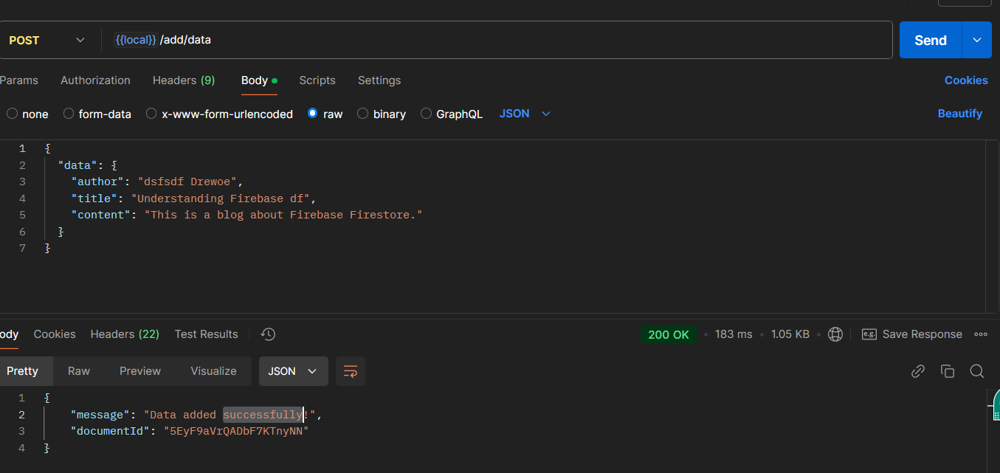
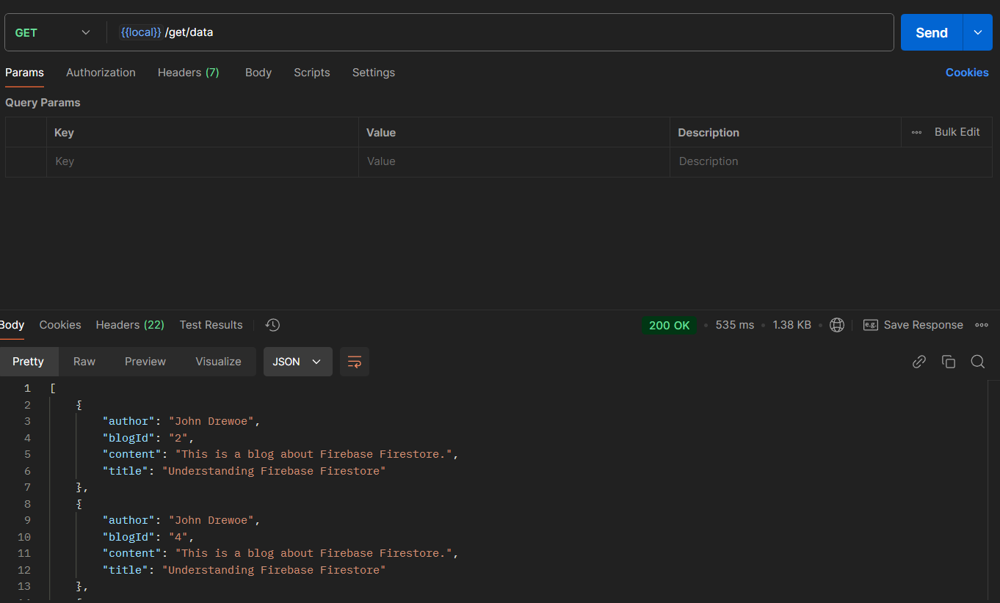
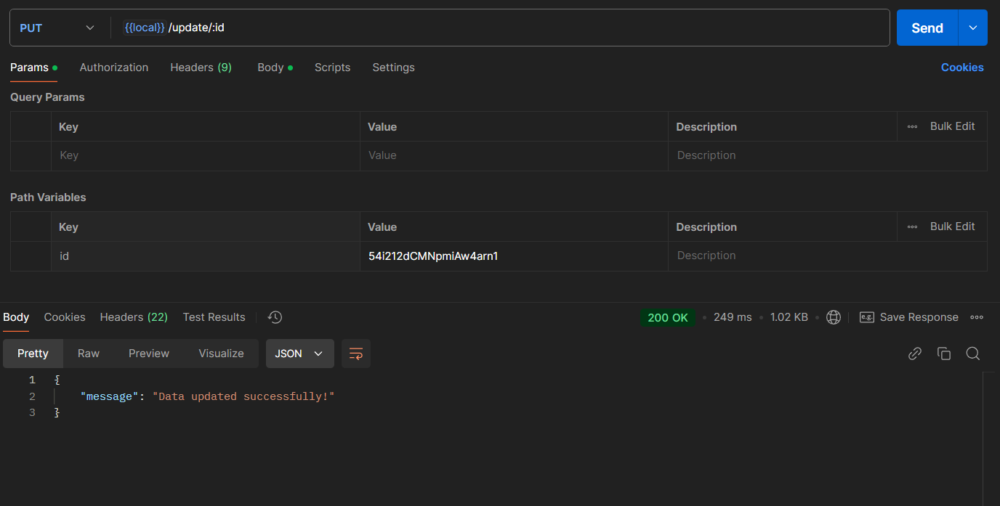
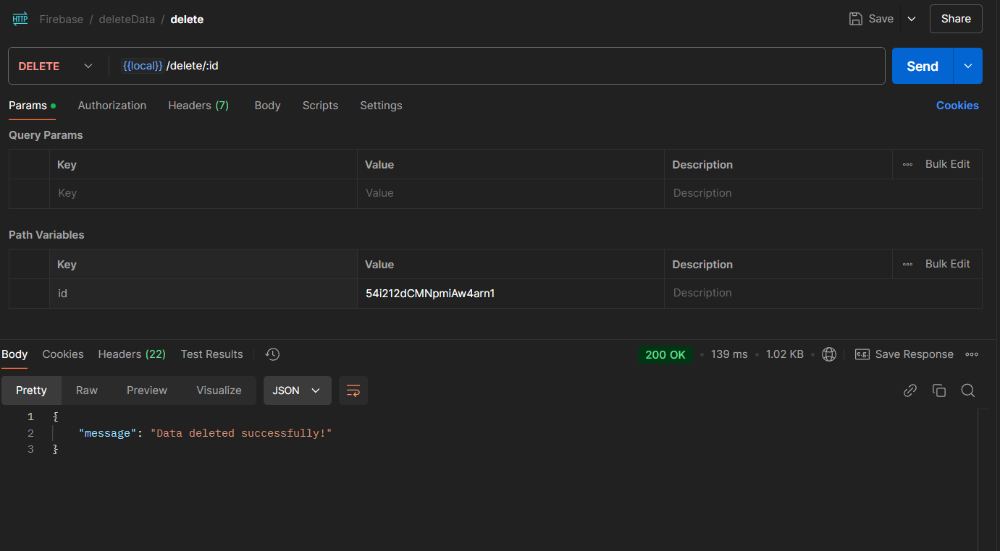
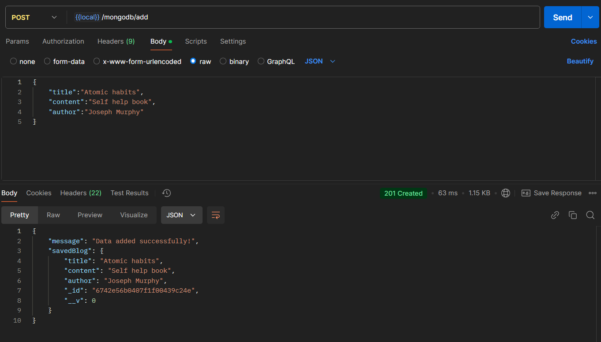
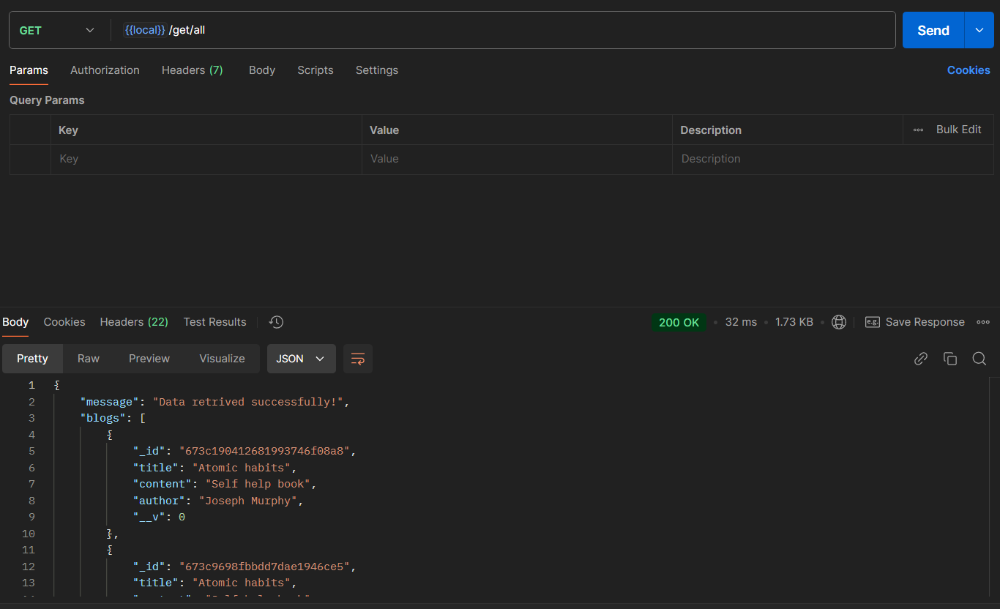
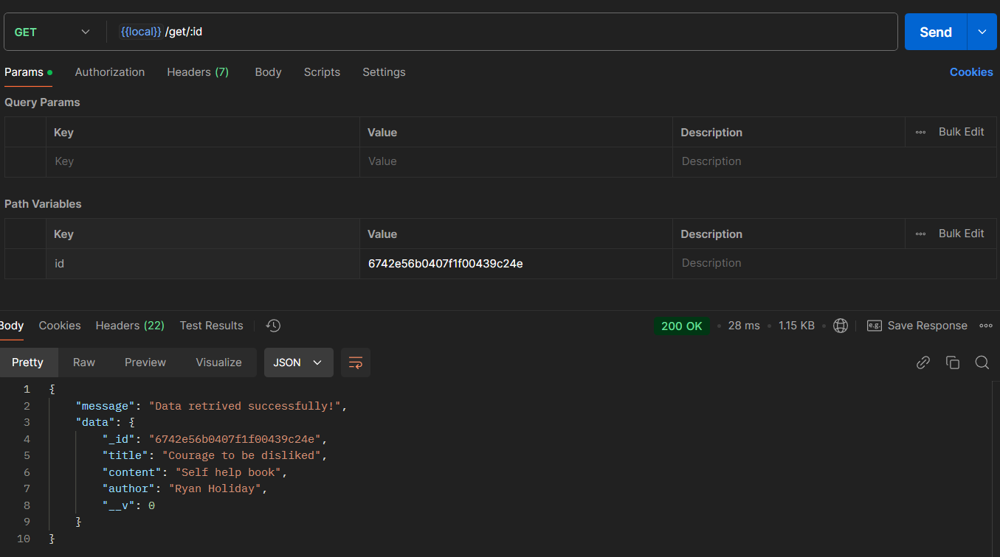
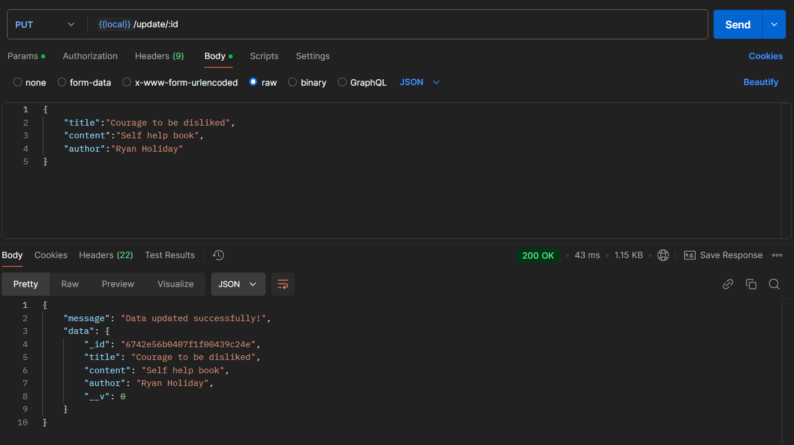
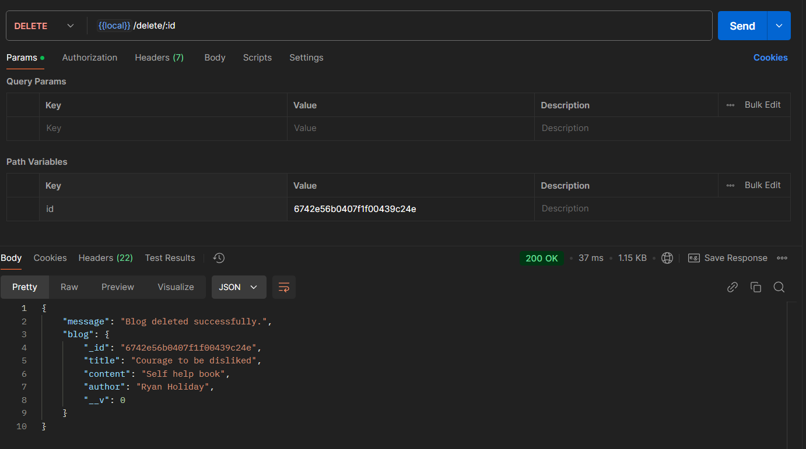

# Firestore to MongoDB Data Transfer Application

## Index
1. [Description](#description)
2. [Technologies Used](#technologies-used)
3. [Installation & Setup](#installation--setup)
4. [API Endpoints](#api-endpoints)
5. [Contributors](#contributors)
6. [File Structure](#file-structure)

## Description
This application provides a backend service to transfer data between Firebase/Firestore and MongoDB databases. It implements full CRUD operations with API endpoints for both databases.

## Technologies Used
- Node.js
- Express.js
- Firebase/Firestore
- MongoDB with Mongoose
- Winston (Logging)
- Express Rate Limiter
- Helmet (Security)
- CORS

## Installation & Setup

### Prerequisites
- Node.js installed
- MongoDB instance running
- Firebase project setup

### Steps to Run
1. Clone the repository
```bash
git clone https://github.com/GauravKesh/Data_Transfer_Firebase_to_MongoDB.git
```
2. Install dependencies:
```bash
npm install
```
3. Create a `.env` file with the following variables:
```env
PORT=8080
DATABASE_URL=your_mongodb_url
FIREBASE_API_KEY=your_firebase_api_key
FIREBASE_AUTH_DOMAIN=your_firebase_auth_domain
FIREBASE_PROJECT_ID=your_firebase_project_id
FIREBASE_STORAGE_BUCKET=your_firebase_storage_bucket
FIREBASE_MESSAGING_SENDER_ID=your_messaging_sender_id
FIREBASE_APP_ID=your_app_id
```
4. Run the application:
```bash
# Development mode
npm run dev

# Production mode
npm start
```

## API Endpoints

### Firebase Operations
- `POST /api/v1/blogs/firebase/add/data` - Add data to Firebase
  

- `GET /api/v1/blogs/firebase/get/data` - Get data from Firebase
  

- `POST /api/v1/blogs/firebase/update/data` - Update data in Firebase
  

- `POST /api/v1/blogs/firebase/delete/data` - Delete data in Firebase
  

### MongoDB Operations
- `POST /api/v1/mongodb/blogs/add` - Create a new blog
  

- `GET /api/v1/mongodb/blogs/get/all` - Get all blogs
  

- `GET /api/v1/mongodb/blogs/get/:id` - Get blog by ID
  

- `PUT /api/v1/mongodb/blogs/update/:id` - Update blog
  

- `DELETE /api/v1/mongodb/blogs/delete/:id` - Delete blog
  

## API Testing Videos

### Firebase API Testing
- [View Firebase API Testing Video](docs/videos/firebase.mp4)
  - Demonstrates testing of:
    - Adding data to Firebase (`POST /api/v1/blogs/firebase/add/data`)
    - Getting data from Firebase (`GET /api/v1/blogs/firebase/get/data`)
    - Updating data in Firebase (`POST /api/v1/blogs/firebase/update/data`)
    - Deleting data in Firebase (`POST /api/v1/blogs/firebase/delete/data`)

### MongoDB API Testing
- [View MongoDB API Testing Video](docs/videos/mongodb.mp4)
  - Demonstrates testing of:
    - Creating a new blog (`POST /api/v1/mongodb/blogs/add`)
    - Getting all blogs (`GET /api/v1/mongodb/blogs/get/all`)
    - Getting blog by ID (`GET /api/v1/mongodb/blogs/get/:id`)
    - Updating blog (`PUT /api/v1/mongodb/blogs/update/:id`)
    - Deleting blog (`DELETE /api/v1/mongodb/blogs/delete/:id`)


## Contributors

### Rohit M (Backend Lead)
- **MongoDB Integration & Development**
  - Designed and implemented complete MongoDB CRUD API architecture
  - Developed and tested MongoDB controllers and routes
  - Implemented data validation and error handling for MongoDB operations
  - Created comprehensive API documentation for MongoDB endpoints
  
- **Testing & Quality Assurance**
  - Created extensive test cases for MongoDB APIs
  - Performed thorough API testing using Postman
  - Documented API responses and error scenarios
  - Set up integration testing environment

### Gaurav Kesh Roushan (Firebase Lead)
- **Firebase Integration & Configuration**
  - Configured and initialized Firebase SDK and Firebase Admin SDK
  - Set up Firebase security rules and authentication
  - Implemented Firebase database connection and error handling
  - Developed Firebase CRUD operation controllers

- **Project Architecture & Management**
  - Established project structure and file organization
  - Managed Git workflow and branch strategy
  - Set up development environment configurations
  - Implemented logging and monitoring systems

### Ayush Kathri (Integration Specialist)
- **Documentation & Testing Support**
  - Created comprehensive API documentation
  - Set up Postman collections for API testing
  - Assisted in debugging and error resolution
  - Maintained testing documentation

- **Integration & Support**
  - Provided technical support for API implementations
  - Assisted in error handling and bug fixes
  - Contributed to code review and optimization


## File Structure
```
src/
├── api/
│   ├── controller/
│   └── router/
├── config/
├── database/
├── models/
├── util/
├── app.js
└── server.js
```

### Key Files and Their Purpose
- `app.js`: Main Express application setup
- `server.js`: Server initialization and database connection
- `database/db.js`: MongoDB connection configuration
- `database/firebase.js`: Firebase initialization
- `api/controller/blogController.js`: MongoDB CRUD operations
- `api/controller/firebaseControllers.js`: Firebase operations
- `models/blogModel.js`: MongoDB schema definition
- `util/logger.js`: Winston logger configuration
- `util/apiRateLimit.js`: Rate limiting configuration

## Dependencies
All required dependencies are listed in `package.json`:
- express
- mongoose
- firebase
- firebase-admin
- winston
- cors
- cors-env
- helmet
- dotenv
- dotenv-flow
- express-rate-limit
- nodemon
